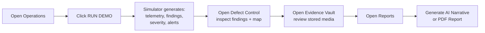
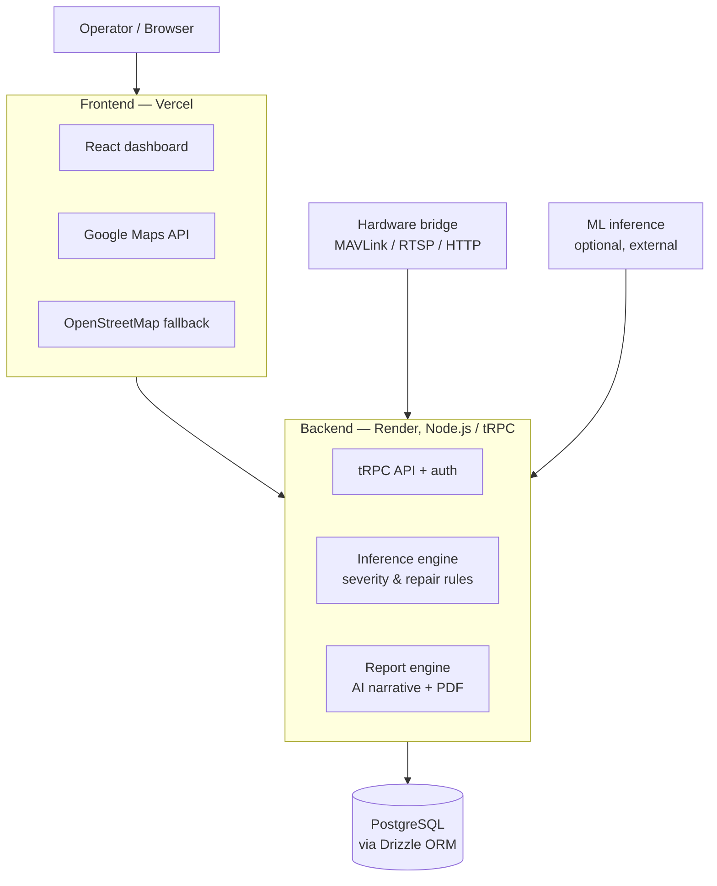
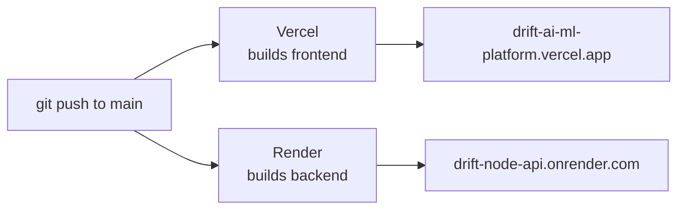
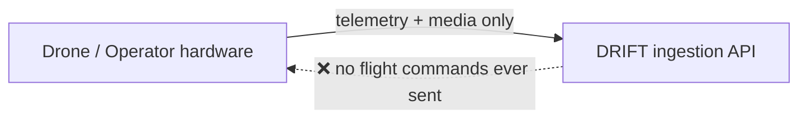

# DRIFT — Drone-Based Reconnaissance & Infrastructure Fault Tracking

AI-assisted infrastructure inspection platform.
Reviews drone/operator evidence → prioritises defects → maps findings to coordinates & telemetry → generates audit-ready reports.

🔗 **Live demo:** https://drift-ai-ml-platform.vercel.app/ (no sign-in needed)

> ⚠️ **Safety boundary:** DRIFT never arms, launches, or controls an aircraft. It only *ingests* operator-approved telemetry and media.

---

## 🧭 What it does

- Reviews drone / operator-captured evidence
- Prioritises and scores defects by severity
- Correlates findings with GPS coordinates + telemetry
- Generates audit-ready AI narrative + PDF reports
- Supports accountable engineer review before action is taken

---

## 🖥️ Demo workspaces

| Workspace | Purpose |
|---|---|
| **Operations** | Run the simulator, see mission status |
| **Defect Control** | List of findings + map markers |
| **Evidence Vault** | Stored photos/video linked to findings |
| **Reports** | Generate AI narrative or PDF report |
| **Hardware Bridge** | View the ingestion boundary (no flight control) |

### Demo flow



---

## 🏗️ Architecture



**In short:**
- 🖼️ **Frontend (Vercel)** — React dashboard, maps with automatic OSM fallback
- ⚙️ **Backend (Render)** — Node.js + tRPC API, defect inference, report generation
- 🗄️ **Database** — PostgreSQL via Drizzle ORM
- 📡 **Hardware bridge** — authenticated, read-only ingestion (no flight control)
- 🧠 **ML inference** — optional external computer-vision service

---

## ✅ What's implemented

- React dashboard (all 5 workspaces above)
- Node.js/tRPC API with validated hardware-ingestion boundary
- PostgreSQL persistence (Drizzle), durable evidence + report storage
- Simulator mode — generates demo data with no real hardware
- Explainable defect-inference adapters + geospatial context
- Severity scoring, repair-cost estimates, AI narratives
- Engineer-review state for accountability

🔒 **Not open in the public demo:** engineer approvals, original-media uploads, hardware-bridge operations — these need authentication.

---

## 🚀 Local development

```bash
pnpm install
pnpm db:push
pnpm dev
pnpm check
pnpm test
pnpm build
```

> Only copy `.env.example` if you're wiring up real hardware or a CV service. Never commit `.env` files or credentials.

---

## ⚙️ Configuration

| Variable | Required | What it's for |
|---|---|---|
| `DRIFT_HARDWARE_ENDPOINT` | No | Operator-approved MAVLink / RTSP / HTTP feed |
| `ML_INFERENCE_URL` | No | External computer-vision endpoint |
| `VITE_BACKEND_URL` | Yes (prod) | Node API origin for tRPC + stored assets |
| `VITE_GOOGLE_MAPS_API_KEY` | Optional | Falls back to OSM if unset/restricted |

Set production secrets in **Vercel** and **Render** dashboards — never in the repo.

---

## 📦 Deployment



- Frontend → **Vercel**
- Backend → **Render**
- Both auto-deploy on push to `main`

---

## 🧪 Testing

```bash
pnpm test    # ZeroError scoring, hardware fallback, telemetry validation,
             # inference adapters, auth boundaries, report generation
pnpm check   # run before every push
pnpm build   # run before every push
```

CI config: [`.github/workflows/ci.yml`](.github/workflows/ci.yml)

---

## 📁 Project structure

```
client/              → React + Vite frontend
server/              → Node.js / tRPC backend
shared/              → Shared types & schemas
drizzle/             → Drizzle schema (dev)
drizzle-postgres/    → Drizzle schema (prod, PostgreSQL)
docs/                → Architecture & deployment docs
scripts/             → Utility scripts
```

---

## 🛡️ Safety boundary



- DRIFT **never** arms, launches, or controls an aircraft
- Hardware layer = authenticated, one-way ingestion only
- Simulator mode issues **zero** flight commands
- Before going live: configure `DRIFT_HARDWARE_ENDPOINT`, validate the payload contract, run an on-site integration test

See [`docs/hardware_adapter_contract.md`](docs/hardware_adapter_contract.md) for the full contract.

---

## 🔗 References
## System Architecture
                                             ┌──────────────────────────────┐
                         │            USERS             │
                         │  Engineer / Operator / Admin  │
                         └──────────────┬───────────────┘
                                        │
                                        ▼
                 ┌─────────────────────────────────────────┐
                 │           DRIFT WEB DASHBOARD            │
                 │              React + TypeScript          │
                 │                                         │
                 │ Operations │ Defects │ Evidence │ Maps  │
                 │ Reports    │ Alerts  │ Hardware Bridge  │
                 └────────────────────┬────────────────────┘
                                      │
                                 tRPC / HTTP
                                      │
                                      ▼
        ┌──────────────────────────────────────────────────────────┐
        │                  NODE.JS + tRPC BACKEND                   │
        │                                                          │
        │  ┌────────────┐ ┌────────────┐ ┌──────────────────────┐ │
        │  │   Mission  │ │  Finding   │ │     Telemetry        │ │
        │  │   Router   │ │   Router   │ │      Router          │ │
        │  └────────────┘ └────────────┘ └──────────────────────┘ │
        │                                                          │
        │  ┌────────────┐ ┌────────────┐ ┌──────────────────────┐ │
        │  │  Evidence  │ │   Report   │ │      Hardware        │ │
        │  │   Router   │ │   Router   │ │       Router          │ │
        │  └────────────┘ └────────────┘ └──────────────────────┘ │
        │                                                          │
        │         BUSINESS LOGIC / ORCHESTRATION                  │
        │  Mission Management │ Finding Processing                │
        │  Telemetry Validation │ Engineer Review                 │
        │  Alert Generation │ Report Generation                   │
        └───────────────┬──────────────┬───────────────┬───────────┘
                        │              │               │
                        ▼              ▼               ▼
              ┌────────────────┐ ┌──────────────┐ ┌─────────────────┐
              │    AI / ML     │ │   DRIZZLE    │ │  GEO-SPATIAL    │
              │    ENGINE      │ │     ORM      │ │     ENGINE      │
              │                │ │              │ │                 │
              │ Computer       │ │ Data Access  │ │ GPS Correlation │
              │ Vision         │ │ Queries      │ │ Coordinates     │
              │                │ │ Persistence  │ │ Map Markers     │
              │ Defect         │ │              │ │ Mission Routes  │
              │ Detection      │ │              │ │                 │
              │ Classification │ │              │ │ Google Maps /   │
              │ Severity       │ │              │ │ OSM Fallback    │
              └───────┬────────┘ └──────┬───────┘ └────────┬────────┘
                      │                  │                  │
                      ▼                  ▼                  │
              ┌────────────────┐ ┌──────────────────┐      │
              │    DECISION    │ │   POSTGRESQL     │      │
              │     ENGINE     │ │     DATABASE     │      │
              │                │ │                  │      │
              │ Severity       │ │ Missions         │      │
              │ Priority       │ │ Findings         │      │
              │ Repair Estimate│ │ Telemetry        │      │
              │ Maintenance    │ │ Evidence         │      │
              │ Alerts         │ │ Reports          │      │
              └───────┬────────┘ │ Alerts           │      │
                      │          └──────────────────┘      │
                      │                                    │
                      └────────────────┬───────────────────┘
                                       │
                                       ▼
                         ┌────────────────────────┐
                         │     EVIDENCE VAULT     │
                         │                        │
                         │ Images / Video         │
                         │ GPS + Timestamp        │
                         │ Finding Association    │
                         │ Mission Association    │
                         └────────────┬───────────┘
                                      │
                                      ▼
                         ┌────────────────────────┐
                         │    ENGINEER REVIEW     │
                         │                        │
                         │ Evidence Verification  │
                         │ Finding Validation     │
                         │ Severity Review        │
                         │ Approval / Review      │
                         └────────────┬───────────┘
                                      │
                                      ▼
                         ┌────────────────────────┐
                         │    REPORTING ENGINE     │
                         │                        │
                         │ AI Narrative            │
                         │ Inspection Summary      │
                         │ Evidence References     │
                         │ PDF Generation          │
                         └────────────┬───────────┘
                                      │
                                      ▼
                         ┌────────────────────────┐
                         │   AUDIT-READY PDF      │
                         │   INSPECTION REPORT    │
                         └────────────┬───────────┘
                                      │
                                      ▼
                         ┌────────────────────────┐
                         │ MAINTENANCE DECISION   │
                         │                        │
                         │ Repair Recommendation  │
                         │ Priority Action        │
                         │ Maintenance Workflow   │
                         └────────────────────────┘


══════════════════════ EXTERNAL DATA ACQUISITION ══════════════════════

        ┌─────────────────────────────────────────────────┐
        │              DRONE / HARDWARE                   │
        │                                                 │
        │ Camera │ Images │ Video │ GPS │ Telemetry      │
        │ HTTP │ RTSP │ MAVLink                          │
        └───────────────────────┬─────────────────────────┘
                                │
                                ▼
                 ┌──────────────────────────────┐
                 │ AUTHENTICATED HARDWARE       │
                 │      INGESTION ADAPTER       │
                 │                              │
                 │ Authentication              │
                 │ Input Validation             │
                 │ Telemetry Parsing            │
                 │ Media Ingestion              │
                 └──────────────┬───────────────┘
                                │
                                ▼
                       NODE.JS + tRPC BACKEND


════════════════════════════ AI INTEGRATION ═══════════════════════════

                 ┌──────────────────────────────┐
                 │ OPTIONAL EXTERNAL ML SERVICE │
                 │                              │
                 │   ML_INFERENCE_URL           │
                 └──────────────┬───────────────┘
                                │
                                ▼
                         AI / ML ENGINE


════════════════════════════ DEPLOYMENT ══════════════════════════════

       ┌──────────────┐          ┌──────────────┐
       │   GITHUB     │─────────▶│   VERCEL     │
       │ Source Code  │          │   Frontend   │
       └──────┬───────┘          └──────┬───────┘
              │                         │
              │                         │ HTTPS
              │                         ▼
              │                  ┌──────────────┐
              └─────────────────▶│    RENDER    │
                                 │ Node.js API  │
                                 └──────┬───────┘
                                        │
                          ┌─────────────┴─────────────┐
                          ▼                           ▼
                   ┌──────────────┐          ┌────────────────┐
                   │ PostgreSQL   │          │ External ML    │
                   │ + Drizzle    │          │ Service        │
                   └──────────────┘          └────────────────┘

## System Architecture
                                             ┌──────────────────────────────┐
                         │            USERS             │
                         │  Engineer / Operator / Admin  │
                         └──────────────┬───────────────┘
                                        │
                                        ▼
                 ┌─────────────────────────────────────────┐
                 │           DRIFT WEB DASHBOARD            │
                 │              React + TypeScript          │
                 │                                         │
                 │ Operations │ Defects │ Evidence │ Maps  │
                 │ Reports    │ Alerts  │ Hardware Bridge  │
                 └────────────────────┬────────────────────┘
                                      │
                                 tRPC / HTTP
                                      │
                                      ▼
        ┌──────────────────────────────────────────────────────────┐
        │                  NODE.JS + tRPC BACKEND                   │
        │                                                          │
        │  ┌────────────┐ ┌────────────┐ ┌──────────────────────┐ │
        │  │   Mission  │ │  Finding   │ │     Telemetry        │ │
        │  │   Router   │ │   Router   │ │      Router          │ │
        │  └────────────┘ └────────────┘ └──────────────────────┘ │
        │                                                          │
        │  ┌────────────┐ ┌────────────┐ ┌──────────────────────┐ │
        │  │  Evidence  │ │   Report   │ │      Hardware        │ │
        │  │   Router   │ │   Router   │ │       Router          │ │
        │  └────────────┘ └────────────┘ └──────────────────────┘ │
        │                                                          │
        │         BUSINESS LOGIC / ORCHESTRATION                  │
        │  Mission Management │ Finding Processing                │
        │  Telemetry Validation │ Engineer Review                 │
        │  Alert Generation │ Report Generation                   │
        └───────────────┬──────────────┬───────────────┬───────────┘
                        │              │               │
                        ▼              ▼               ▼
              ┌────────────────┐ ┌──────────────┐ ┌─────────────────┐
              │    AI / ML     │ │   DRIZZLE    │ │  GEO-SPATIAL    │
              │    ENGINE      │ │     ORM      │ │     ENGINE      │
              │                │ │              │ │                 │
              │ Computer       │ │ Data Access  │ │ GPS Correlation │
              │ Vision         │ │ Queries      │ │ Coordinates     │
              │                │ │ Persistence  │ │ Map Markers     │
              │ Defect         │ │              │ │ Mission Routes  │
              │ Detection      │ │              │ │                 │
              │ Classification │ │              │ │ Google Maps /   │
              │ Severity       │ │              │ │ OSM Fallback    │
              └───────┬────────┘ └──────┬───────┘ └────────┬────────┘
                      │                  │                  │
                      ▼                  ▼                  │
              ┌────────────────┐ ┌──────────────────┐      │
              │    DECISION    │ │   POSTGRESQL     │      │
              │     ENGINE     │ │     DATABASE     │      │
              │                │ │                  │      │
              │ Severity       │ │ Missions         │      │
              │ Priority       │ │ Findings         │      │
              │ Repair Estimate│ │ Telemetry        │      │
              │ Maintenance    │ │ Evidence         │      │
              │ Alerts         │ │ Reports          │      │
              └───────┬────────┘ │ Alerts           │      │
                      │          └──────────────────┘      │
                      │                                    │
                      └────────────────┬───────────────────┘
                                       │
                                       ▼
                         ┌────────────────────────┐
                         │     EVIDENCE VAULT     │
                         │                        │
                         │ Images / Video         │
                         │ GPS + Timestamp        │
                         │ Finding Association    │
                         │ Mission Association    │
                         └────────────┬───────────┘
                                      │
                                      ▼
                         ┌────────────────────────┐
                         │    ENGINEER REVIEW     │
                         │                        │
                         │ Evidence Verification  │
                         │ Finding Validation     │
                         │ Severity Review        │
                         │ Approval / Review      │
                         └────────────┬───────────┘
                                      │
                                      ▼
                         ┌────────────────────────┐
                         │    REPORTING ENGINE     │
                         │                        │
                         │ AI Narrative            │
                         │ Inspection Summary      │
                         │ Evidence References     │
                         │ PDF Generation          │
                         └────────────┬───────────┘
                                      │
                                      ▼
                         ┌────────────────────────┐
                         │   AUDIT-READY PDF      │
                         │   INSPECTION REPORT    │
                         └────────────┬───────────┘
                                      │
                                      ▼
                         ┌────────────────────────┐
                         │ MAINTENANCE DECISION   │
                         │                        │
                         │ Repair Recommendation  │
                         │ Priority Action        │
                         │ Maintenance Workflow   │
                         └────────────────────────┘


══════════════════════ EXTERNAL DATA ACQUISITION ══════════════════════

        ┌─────────────────────────────────────────────────┐
        │              DRONE / HARDWARE                   │
        │                                                 │
        │ Camera │ Images │ Video │ GPS │ Telemetry      │
        │ HTTP │ RTSP │ MAVLink                          │
        └───────────────────────┬─────────────────────────┘
                                │
                                ▼
                 ┌──────────────────────────────┐
                 │ AUTHENTICATED HARDWARE       │
                 │      INGESTION ADAPTER       │
                 │                              │
                 │ Authentication              │
                 │ Input Validation             │
                 │ Telemetry Parsing            │
                 │ Media Ingestion              │
                 └──────────────┬───────────────┘
                                │
                                ▼
                       NODE.JS + tRPC BACKEND


════════════════════════════ AI INTEGRATION ═══════════════════════════

                 ┌──────────────────────────────┐
                 │ OPTIONAL EXTERNAL ML SERVICE │
                 │                              │
                 │   ML_INFERENCE_URL           │
                 └──────────────┬───────────────┘
                                │
                                ▼
                         AI / ML ENGINE


════════════════════════════ DEPLOYMENT ══════════════════════════════

       ┌──────────────┐          ┌──────────────┐
       │   GITHUB     │─────────▶│   VERCEL     │
       │ Source Code  │          │   Frontend   │
       └──────┬───────┘          └──────┬───────┘
              │                         │
              │                         │ HTTPS
              │                         ▼
              │                  ┌──────────────┐
              └─────────────────▶│    RENDER    │
                                 │ Node.js API  │
                                 └──────┬───────┘
                                        │
                          ┌─────────────┴─────────────┐
                          ▼                           ▼
                   ┌──────────────┐          ┌────────────────┐
                   │ PostgreSQL   │          │ External ML    │
                   │ + Drizzle    │          │ Service        │
                   └──────────────┘          └────────────────┘

## References

- [Live demo](https://drift-ai-ml-platform.vercel.app/)
- [Deployment docs](docs/deployment.md)
- [Hardware adapter contract](docs/hardware_adapter_contract.md)
- [CI workflow](.github/workflows/ci.yml)
