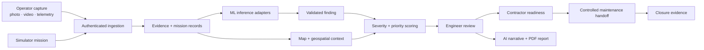
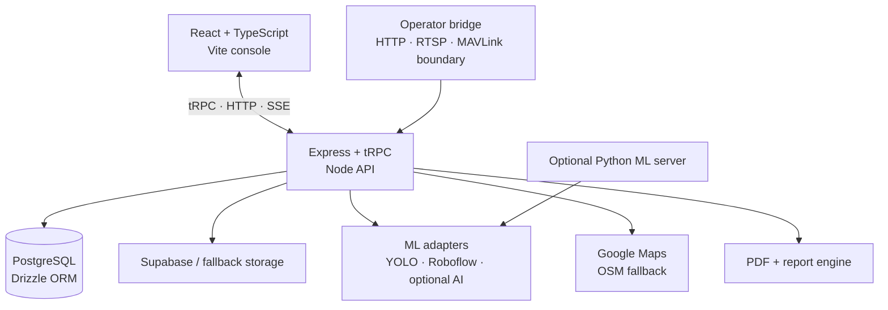
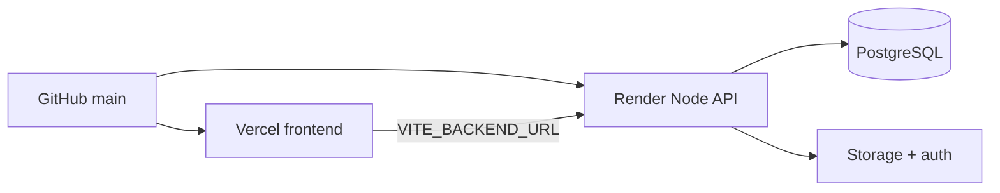

<div align="center">

# DRIFT

### **AI-powered infrastructure inspection, live evidence, and accountable maintenance**

<p>
  <a href="https://drift-ai-ml-platform.vercel.app/"><strong>Launch Live Demo</strong></a> ·
  <a href="https://github.com/RidhimaKulashriz/DRIFT-AI-ML-Platform/issues">Report an Issue</a> ·
  <a href="docs/deployment.md">Deploy DRIFT</a>
</p>


<br />

> **See a defect. Understand the evidence. Prioritise the response. Prove the decision.**

</div>

---

## ⚡ What is DRIFT?

DRIFT turns inspection media and telemetry into a reviewable maintenance workflow. It connects live or simulated capture, computer-vision assistance, geospatial context, engineer review, contractor readiness, and audit-oriented reporting in one console.

```text
Capture → Detect → Correlate → Review → Prioritise → Report → Verify
```

> **Important:** DRIFT is an inspection and decision-support platform. It does **not** arm, launch, or control aircraft. Hardware integrations only ingest operator-approved telemetry and media.

<details>
<summary><strong>🎯 Why DRIFT exists</strong></summary>
<br />

Most inspection tools stop at “a model found something.” DRIFT keeps the chain visible:

- What was captured?
- Where and when was it captured?
- Was it live, simulated, uploaded, or public reference media?
- What did the model infer?
- What did an engineer verify or reject?
- What action is safe to hand off?
- What evidence proves closure?

</details>

## 🧭 Explore the live demo

<div align="center">

| [🚀 Operations](https://drift-ai-ml-platform.vercel.app/?workspace=operations) | [⚠️ Defect Control](https://drift-ai-ml-platform.vercel.app/?workspace=defects) | [🎥 Evidence Vault](https://drift-ai-ml-platform.vercel.app/?workspace=evidence) |
|:---:|:---:|:---:|
| Run a mission and watch the system respond | Filter and inspect findings | Review media, provenance, GPS, and timestamps |

| [📄 Reports](https://drift-ai-ml-platform.vercel.app/?workspace=reports) | [🧰 Contractors](https://drift-ai-ml-platform.vercel.app/?workspace=contractors) | [📡 Hardware Bridge](https://drift-ai-ml-platform.vercel.app/?workspace=hardware) |
|:---:|:---:|:---:|
| Generate narratives and PDFs | Check readiness and handoff controls | Inspect authenticated ingestion boundaries |

</div>

### 90-second demo path

1. Open **Operations** and select **Run Demo**.
2. Move to **Defect Control** to inspect severity, coordinates, and status.
3. Open **Evidence Vault** to see the source media and provenance.
4. Open **Reports** and generate a narrative or PDF.
5. Visit **Accountability** before treating any result as an operational decision.

<details>
<summary><strong>🧪 What the demo data means</strong></summary>
<br />

Simulator output and public-dataset imagery demonstrate the product flow. They are **not** live UAV evidence, proof of structural damage, a safety determination, an approved work order, or an engineer’s conclusion.

</details>

## 🖥️ Product surface

| Workspace | What you can do |
|:--|:--|
| **Operations** | Mission status, telemetry, alerts, simulator runs, and inspection overview |
| **Defect control** | Filter by severity, defect type, domain, mission, asset, status, and review state |
| **Evidence vault** | Inspect photos, videos, coordinates, timestamps, source, quality, and provenance |
| **Reports** | Generate AI-assisted narratives and audit-oriented PDF reports |
| **Accountability** | Separate observed evidence, model inference, engineer decision, contractor action, and closure proof |
| **Contractors** | Review readiness, work profiles, RAG handoff candidates, and maintenance controls |
| **Rail monitoring** | Review rail-focused inspection context and track-fault findings |
| **Traffic data** | Add traffic context to inspection and prioritisation workflows |
| **Hardware bridge** | Monitor the operator-approved telemetry and media ingestion boundary |

## 🔁 How the platform works



## 🧱 Architecture



<details>
<summary><strong>📂 Repository map</strong></summary>
<br />

| Folder | Role |
|:--|:--|
| [`client/`](client/) | React pages, dashboard components, maps, live panels, and styling |
| [`server/`](server/) | Express/tRPC API, services, ingestion, inference, reports, auth, and tests |
| [`shared/`](shared/) | Shared types, scoring rules, domains, maps, and demo data |
| [`ml-server/`](ml-server/) | Optional Python inference service and local YOLO models |
| [`scripts/`](scripts/) | Media bridge, frame capture, upload, and verification helpers |
| [`tools/`](tools/) | DJI export integration helper |
| [`docs/`](docs/) | Deployment, integration, security, and validation runbooks |
| [`drizzle/`](drizzle/) | Database migrations and relations |
| [`render.yaml`](render.yaml) | Render service definition |

</details>

## 🧰 Run it locally

### Prerequisites

- Node.js 20+ (Node.js 22 recommended)
- pnpm 10
- PostgreSQL for persistent local development
- Python 3.10+ only for the optional ML server

### Start the full-stack app

```bash
# 1. Install the project package manager and dependencies
corepack enable
pnpm install

# 2. Create local configuration
cp .env.example .env

# 3. Set DATABASE_URL in .env, then prepare the database
pnpm db:push

# 4. Start the frontend + Node API
pnpm dev
```

### Command cockpit

| Command | Use it for |
|:--|:--|
| `pnpm dev` | Development server with Vite and live reload |
| `pnpm check` | TypeScript validation |
| `pnpm test` | Vitest test suite |
| `pnpm build` | Production frontend and bundled Node server |
| `pnpm start` | Run the production bundle |
| `pnpm db:push` | Generate and apply Drizzle migrations |
| `pnpm test:bridge` | Verify bridge routes |
| `pnpm bridge:media` | Start the media bridge helper |
| `pnpm format` | Format source files with Prettier |

## 🤖 Optional ML service

The [`ml-server/`](ml-server/) service exposes a Python HTTP API for the checked-in local models and optional Roboflow-backed models.

| Model | Backend | Purpose |
|:--|:--|:--|
| **CRACK** | Local YOLO | Crack detection |
| **ROAD** | Local YOLO | Road damage and potholes |
| **RAILWAY** | Roboflow API | Track fault detection |
| **RUST** | Roboflow API | Corrosion detection |

```bash
cd ml-server
python -m pip install -r requirements.txt
python server.py
```

Endpoints:

- `GET /health`
- `POST /detect` — multipart image testing
- `POST /detect-base64` — DRIFT backend integration

Point the Node service at the ML server with `ML_INFERENCE_URL`. See [`ml-server/README.md`](ml-server/README.md) for model setup, credentials, request payloads, and response format.

## 🔌 API and live ingestion

| Method | Endpoint | Purpose |
|:--:|:--|:--|
| `POST` | `/api/drift/telemetry` | Validate and persist bridge telemetry |
| `POST` | `/api/drift/evidence` | Store image/video evidence and optionally run inference |
| `GET` | `/api/drift/live/events?missionId=<id>` | Stream live mission events with Server-Sent Events |
| `GET` | `/api/drift/evidence-media/<encoded-key>` | Proxy protected evidence media |
| `POST` | `/api/inspections` | Run the full inspection pipeline for an uploaded image |

Bridge requests require `DRIFT_INGEST_TOKEN` as a Bearer token or `x-drift-ingest-token`. Payloads are MIME-, size-, coordinate-, timestamp-, and rate-limited. Automated findings remain subject to engineer review.

<details>
<summary><strong>🛡️ Safety and evidence rules</strong></summary>
<br />

- A model confidence value is not a probability of structural failure.
- A coordinate is a location reference, not a survey boundary.
- Simulator and public-reference media are not live inspection evidence.
- Inference is advisory until an authorised engineer reviews the original evidence.
- Repair estimates are planning inputs, not approved budgets.
- Contractor matches are handoff candidates, not proof of completion.
- DRIFT does not issue flight commands.
- Secrets must remain server-side and out of Git history.

</details>

## ☁️ Deployment

DRIFT uses the deployment path below:



1. Run `pnpm check`, `pnpm test`, and `pnpm build`.
2. Configure PostgreSQL and server-side secrets in Render.
3. Set `VITE_BACKEND_URL` to the public Node API origin.
4. Configure CORS, OAuth, storage, ML, and bridge settings.
5. Deploy the frontend to Vercel and the API to Render.
6. Verify persistence, evidence storage, PDF generation, map fallback, and authenticated ingestion.

Read [`docs/deployment.md`](docs/deployment.md) and [`docs/external_hosting.md`](docs/external_hosting.md) before deploying.

## 🔐 Configuration quick reference

| Variable | Why it matters |
|:--|:--|
| `DATABASE_URL` | PostgreSQL connection |
| `VITE_BACKEND_URL` | Browser-facing API origin |
| `ML_INFERENCE_URL` | Optional external inference endpoint |
| `ML_INFERENCE_TOKEN` | Private inference-service token |
| `DRIFT_INGEST_TOKEN` | Authenticates telemetry and evidence bridges |
| `DRIFT_HARDWARE_ENDPOINT` | Optional bridge health endpoint |
| `VITE_GOOGLE_MAPS_API_KEY` | Optional Google Maps browser key |
| `VITE_DRIFT_LIVE_STREAM_URL` | Optional HLS live stream |
| `DRIFT_ANNOTATED_RTMP_URL` | Optional annotated-frame RTMP output |
| `SUPABASE_URL` + keys | Optional auth and object storage |
| `OPENAI_API_KEY` / `GEMINI_API_KEY` | Optional AI decision-support or fallback adapters |

See [`.env.example`](.env.example) for the complete template. Never commit `.env`, API keys, tokens, database URLs, or service-role credentials.

## 📚 Documentation control room

- [Deployment guide](docs/deployment.md)
- [External hosting](docs/external_hosting.md)
- [Hardware adapter contract](docs/hardware_adapter_contract.md)
- [Operator UAV capture guide](docs/operator_uav_capture_guide.md)
- [Windows live workflow](docs/windows-live-workflow.md)
- [Security lifecycle audit](docs/security_lifecycle_audit.md)
- [Industry readiness contract](docs/industry_readiness_contract.md)
- [ML server guide](ml-server/README.md)

## 🌍 Production links

| Service | Link |
|:--|:--|
| Live frontend | [drift-ai-ml-platform.vercel.app](https://drift-ai-ml-platform.vercel.app/) |
| Node API | [drift-node-api.onrender.com](https://drift-node-api.onrender.com/) |
| Repository | [GitHub](https://github.com/RidhimaKulashriz/DRIFT-AI-ML-Platform) |

<div align="center">

### Built to make inspection decisions **traceable**.

<a href="https://drift-ai-ml-platform.vercel.app/"><strong>▶ Open DRIFT</strong></a>

<br /><br />

<sub>MIT License · Infrastructure intelligence with human accountability</sub>

</div>
