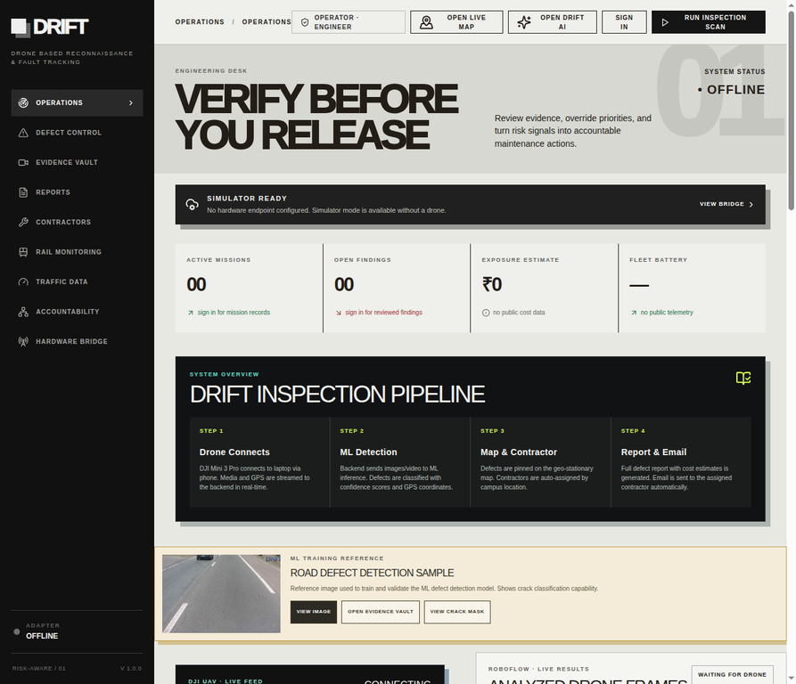
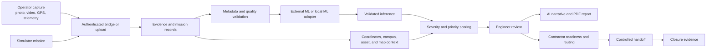
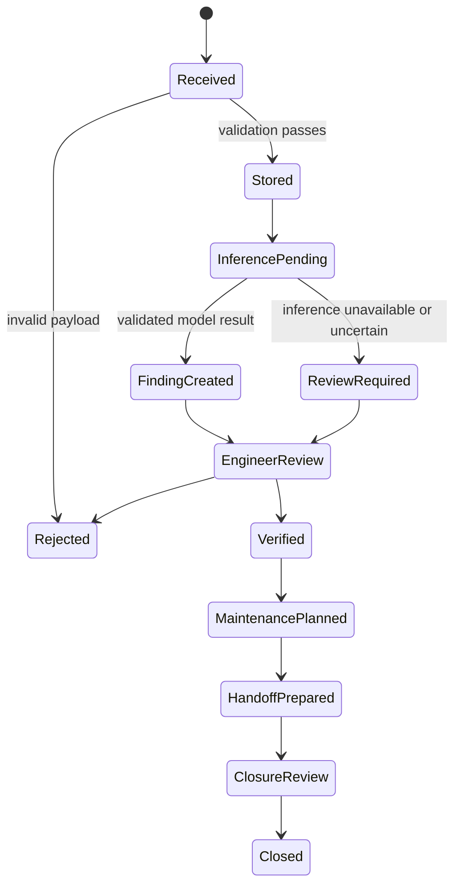
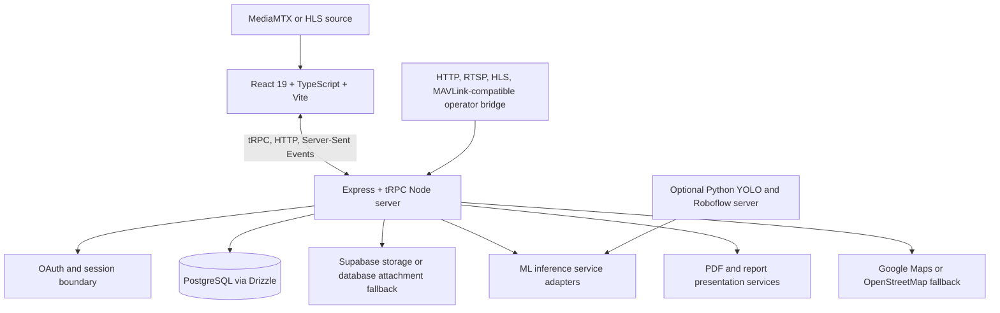
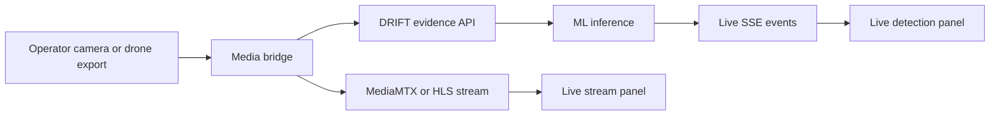
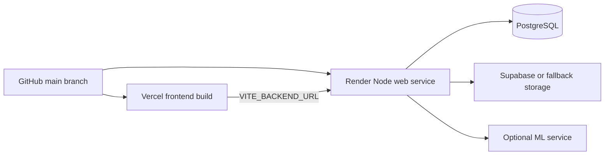

<div align="center">

# DRIFT

## Infrastructure inspection, live evidence, and accountable maintenance

[](https://drift-ai-ml-platform.vercel.app/)
[](https://react.dev/)
[](https://trpc.io/)
[](https://orm.drizzle.team/)
[](ml-server/)
[](package.json)

**Capture evidence. Detect conditions. Correlate location. Review risk. Coordinate action. Preserve accountability.**

[Open the live product](https://drift-ai-ml-platform.vercel.app/) · [Read the deployment guide](docs/deployment.md) · [Browse the source tree](#repository-map)

</div>

---

## Contents

- [Product overview](#product-overview)
- [Live product walkthrough](#live-product-walkthrough)
- [Current interface](#current-interface)
- [System workflow](#system-workflow)
- [Codebase architecture](#codebase-architecture)
- [Repository map](#repository-map)
- [Data model](#data-model)
- [Local development](#local-development)
- [ML service](#optional-ml-service)
- [Ingestion API](#ingestion-api)
- [Live media pipeline](#live-media-pipeline)
- [Configuration](#configuration)
- [Testing](#testing)
- [Deployment](#deployment)
- [Security and safety boundaries](#security-and-safety-boundaries)
- [Documentation map](#documentation-map)
- [Contribution workflow](#contribution-workflow)

---

## Product overview

DRIFT is a full-stack infrastructure inspection platform. It accepts inspection media and telemetry from a simulator, upload workflow, or operator-approved hardware bridge. It stores the original evidence, preserves provenance, optionally runs machine-learning inference, correlates findings with coordinates and assets, calculates explainable priority scores, and gives authorised users a review and maintenance workflow.

DRIFT is designed around the distinction between **observed evidence**, **automated inference**, **engineer decision**, **contractor action**, and **closure evidence**. A model result is never presented as a completed engineering conclusion.

```text
Source media and telemetry
          |
          v
Evidence and mission records
          |
          v
Validated ML inference and geospatial context
          |
          v
Severity, priority, alerts, and repair planning
          |
          v
Engineer review and accountability state
          |
          v
Report generation and controlled contractor handoff
          |
          v
Closure evidence and audit trail
```

### What is implemented

| Capability | Current implementation |
|:--|:--|
| Web console | React 19, TypeScript, Vite, Tailwind-compatible UI, Wouter routing |
| API | Express server with tRPC procedures and direct REST ingestion routes |
| Persistence | PostgreSQL-compatible schema with Drizzle ORM and migrations |
| Evidence | Image/video storage, database attachment fallback, provenance, timestamps, GPS, camera and capture-zone metadata |
| Detection | Local Python YOLO models, optional Roboflow models, optional external inference, deterministic/demo adapters |
| Live updates | Server-Sent Events for mission events and live detections |
| Geospatial review | Google Maps when configured, OpenStreetMap fallback, campus and mission coordinates |
| Decision support | Explainable severity and priority scoring, AI narratives, retrieval-backed accountability answers |
| Reporting | PDF generation, evidence references, mission context, interpretation limits, maintenance planning |
| Integrations | DJI export helper, HTTP bridge, RTSP/HLS media, MediaMTX-compatible annotated stream, SMTP/webhook delivery |
| Deployment | Vercel frontend and Render Node service, with PostgreSQL and optional Supabase integrations |

> DRIFT does not arm, launch, navigate, or control an aircraft. Hardware integrations are ingestion boundaries for operator-approved telemetry and media.

---

## Live product walkthrough

The live application is the most interactive way to understand the product. Each link opens the corresponding workspace directly.

| Workspace | Direct link | What to inspect |
|:--|:--|:--|
| Operations | [Open Operations](https://drift-ai-ml-platform.vercel.app/?workspace=operations) | Run the simulator, inspect mission status, telemetry, alerts, and overview metrics |
| Defect control | [Open Defect Control](https://drift-ai-ml-platform.vercel.app/?workspace=defects) | Filter findings by severity, type, domain, asset, mission, status, and review state |
| Evidence vault | [Open Evidence Vault](https://drift-ai-ml-platform.vercel.app/?workspace=evidence) | Review original media, source classification, GPS, timestamps, camera, quality, and provenance |
| Reports | [Open Reports](https://drift-ai-ml-platform.vercel.app/?workspace=reports) | Generate an AI narrative or PDF inspection report |
| Contractors | [Open Contractors](https://drift-ai-ml-platform.vercel.app/?workspace=contractors) | Review contractor readiness and controlled handoff candidates |
| Rail monitoring | [Open Rail Monitoring](https://drift-ai-ml-platform.vercel.app/?workspace=trains) | Review rail and track-focused monitoring context |
| Traffic data | [Open Traffic Data](https://drift-ai-ml-platform.vercel.app/?workspace=traffic) | Review traffic context used in inspection workflows |
| Accountability | [Open Accountability](https://drift-ai-ml-platform.vercel.app/?workspace=accountability) | Separate evidence, inference, review, routing, handoff, and closure state |
| Hardware bridge | [Open Hardware Bridge](https://drift-ai-ml-platform.vercel.app/?workspace=hardware) | Inspect the bridge boundary and operational integration status |

### Recommended interaction sequence

1. Open [Operations](https://drift-ai-ml-platform.vercel.app/?workspace=operations).
2. Select **Run Inspection Scan** or the simulator action in the console.
3. Open [Defect Control](https://drift-ai-ml-platform.vercel.app/?workspace=defects) and select a finding.
4. Inspect the linked evidence, map location, severity explanation, quality state, and review state.
5. Open [Evidence Vault](https://drift-ai-ml-platform.vercel.app/?workspace=evidence) and compare the source media with the automated result.
6. Open [Reports](https://drift-ai-ml-platform.vercel.app/?workspace=reports) and generate a report.
7. Open [Accountability](https://drift-ai-ml-platform.vercel.app/?workspace=accountability) to see why a finding still requires human review.

### Product screenshot

The image below is captured from the current deployed dashboard. The sidebar is the workspace navigator; the main console exposes the mission status, simulator state, metrics, inspection pipeline, evidence reference, live stream, detection results, map, filters, and review controls.

<p align="center">
  
</p>

### GitHub README interaction model

GitHub README files do not execute custom JavaScript, embedded React, or arbitrary CSS. The interactive elements in this README therefore use features GitHub supports reliably:

- direct links into every live workspace;
- native collapsible sections using `details` and `summary`;
- Mermaid diagrams rendered by GitHub;
- linked source folders, deployment guides, API contracts, and live services;
- a repository screenshot tied to the current product UI.

For stateful interaction, use the [live DRIFT application](https://drift-ai-ml-platform.vercel.app/).

---

## Current interface

The frontend is a single dashboard console at `/`. Workspace selection is controlled by the `workspace` query parameter. The available keys are:

```text
operations
 defects
 evidence
 reports
 contractors
 trains
 traffic
 accountability
 hardware
```

The main page is implemented in [`client/src/pages/DriftConsole.tsx`](client/src/pages/DriftConsole.tsx). Its current interface includes:

- mission and system status cards;
- simulator mission controls;
- live stream and live detection panels;
- inspection map with defect markers and telemetry controls;
- evidence vault and public-reference visual card;
- severity, defect-type, domain, status, review, mission, and asset filters;
- AI inspection assistant and voice controls;
- contractor readiness and maintenance queue actions;
- rail monitoring and traffic context panels;
- hardware bridge status;
- PDF report generation and attachment access;
- sign-in boundary for protected operational actions.

<details>
<summary><strong>Open the frontend entry points</strong></summary>

| File | Responsibility |
|:--|:--|
| [`client/src/main.tsx`](client/src/main.tsx) | React application bootstrap |
| [`client/src/App.tsx`](client/src/App.tsx) | Theme, providers, route switch, and error boundary |
| [`client/src/pages/DriftConsole.tsx`](client/src/pages/DriftConsole.tsx) | Main product console and workspace state |
| [`client/src/components/InspectionMap.tsx`](client/src/components/InspectionMap.tsx) | Geospatial inspection map |
| [`client/src/components/LiveStreamPanel.tsx`](client/src/components/LiveStreamPanel.tsx) | Browser live stream panel |
| [`client/src/components/LiveDetectionPanel.tsx`](client/src/components/LiveDetectionPanel.tsx) | Live detection result panel |
| [`client/src/components/LivePipelinePanel.tsx`](client/src/components/LivePipelinePanel.tsx) | Live processing state and events |
| [`client/src/components/AIChatBox.tsx`](client/src/components/AIChatBox.tsx) | DRIFT AI inspection assistant |
| [`client/src/components/ContractorReadinessBoard.tsx`](client/src/components/ContractorReadinessBoard.tsx) | Contractor readiness and evidence controls |
| [`client/src/lib/trpc.ts`](client/src/lib/trpc.ts) | Browser tRPC client |
| [`client/src/lib/driftInteractions.ts`](client/src/lib/driftInteractions.ts) | Interaction and filter helpers |
| [`client/src/index.css`](client/src/index.css) | Global visual system and dashboard styling |

</details>

---

## System workflow



### Evidence lifecycle



### Inference priority

The Node service uses the configured inference path and preserves an unavailable state rather than fabricating a detection:

1. An external ML endpoint configured by `ML_INFERENCE_URL` may be called first.
2. A configured AI or built-in adapter may provide fallback decision support.
3. A deterministic or demo result may be used only where the application explicitly identifies the result as simulated or fallback.
4. If inference is unavailable, the record remains reviewable without a fabricated finding.

The main implementation is [`server/services/mlInference.ts`](server/services/mlInference.ts). The full upload pipeline is [`server/services/inspectionPipeline.ts`](server/services/inspectionPipeline.ts).

---

## Codebase architecture



### Backend entry points

| File | Responsibility |
|:--|:--|
| [`server/_core/index.ts`](server/_core/index.ts) | Express server, CORS, JSON limits, REST ingestion, SSE, storage proxy, OAuth, Vite/static serving |
| [`server/routers.ts`](server/routers.ts) | Main tRPC router and domain procedures |
| [`server/featureRouter.ts`](server/featureRouter.ts) | Feature-specific router composition |
| [`server/db.ts`](server/db.ts) | Database access, persistence helpers, attachment storage, schema readiness |
| [`server/storage.ts`](server/storage.ts) | Storage abstraction and fallback handling |
| [`server/liveEvents.ts`](server/liveEvents.ts) | Mission event publication and subscription |
| [`server/services/inspectionPipeline.ts`](server/services/inspectionPipeline.ts) | Full media-to-inspection pipeline |
| [`server/services/mlInference.ts`](server/services/mlInference.ts) | External inference and fallback adapters |
| [`server/services/scoring.ts`](server/services/scoring.ts) | Finding severity and priority logic |
| [`server/services/reviewState.ts`](server/services/reviewState.ts) | Engineer review state transitions |
| [`server/services/reportPdf.ts`](server/services/reportPdf.ts) | PDF report generation |
| [`server/services/reportPresentation.ts`](server/services/reportPresentation.ts) | Report presentation output |
| [`server/services/hardwareAdapter.ts`](server/services/hardwareAdapter.ts) | Token authorization and telemetry payload validation |
| [`server/services/droneConnection.ts`](server/services/droneConnection.ts) | Hardware connection health and bridge status |
| [`server/services/authorization.ts`](server/services/authorization.ts) | Role and workflow authorization |
| [`server/services/rag.ts`](server/services/rag.ts) | Retrieval-backed accountability answers |
| [`server/services/contractorDelivery.ts`](server/services/contractorDelivery.ts) | Controlled contractor delivery workflow |
| [`server/services/videoFrameExtractor.ts`](server/services/videoFrameExtractor.ts) | Video frame extraction for inspection processing |

### Shared domain layer

The [`shared/`](shared/) directory contains types and deterministic domain data used by both frontend and backend:

- [`shared/types.ts`](shared/types.ts) exports the database types and inspection domain constants.
- [`shared/priorityScoring.ts`](shared/priorityScoring.ts) contains priority calculations and repair-cost formatting.
- [`shared/campusCoordinates.ts`](shared/campusCoordinates.ts) contains campus coordinate references.
- [`shared/campusMapData.ts`](shared/campusMapData.ts) contains map context.
- [`shared/campusDefects.ts`](shared/campusDefects.ts) and [`shared/campusDemoDefects.ts`](shared/campusDemoDefects.ts) contain demonstration defect data.
- [`shared/contractors.ts`](shared/contractors.ts) contains contractor readiness data.
- [`shared/trafficData.ts`](shared/trafficData.ts) and [`shared/trainData.ts`](shared/trainData.ts) contain domain context for traffic and rail views.

---

## Repository map

```text
DRIFT-AI-ML-Platform/
├── client/
│   ├── src/
│   │   ├── components/       Product panels, maps, live views, assistant, controls
│   │   ├── pages/            DriftConsole and not-found route
│   │   ├── contexts/         Theme and UI context
│   │   ├── hooks/            Mobile and composition hooks
│   │   └── lib/              tRPC, interaction, Supabase, and utility helpers
│   └── public/               Static browser assets
├── server/
│   ├── _core/                Server bootstrap, OAuth, tRPC, storage proxy, Vite
│   ├── services/             Inference, scoring, reports, bridge, auth, delivery
│   ├── db.ts                 Database queries and persistence helpers
│   ├── routers.ts             tRPC procedures
│   └── *.test.ts              Vitest coverage for core workflows
├── shared/                   Shared types and domain data
├── ml-server/                Optional Python inference API and YOLO weights
├── scripts/                  Bridge, uploads, HLS, frame source, and route checks
├── tools/                    DJI export helper
├── drizzle/                  Primary Drizzle migrations and relations
├── drizzle-postgres/         PostgreSQL migration history
├── docs/                     Deployment, contracts, audits, and runbooks
├── client/index.html         Vite HTML entry
├── package.json              Scripts, dependencies, and package metadata
├── pnpm-lock.yaml            Reproducible dependency lockfile
├── render.yaml               Render web-service definition
├── vercel.json               Vercel configuration
├── vite.config.ts            Vite configuration
├── drizzle.config.ts        Drizzle configuration
├── vitest.config.ts          Test configuration
├── tsconfig.json             TypeScript configuration
└── .env.example              Environment variable template
```

---

## Data model

The primary schema is defined in [`drizzle/schema.ts`](drizzle/schema.ts). The application stores more than a simple defect list; it models the evidence, decision, routing, and accountability chain.

| Entity group | Examples | Why it exists |
|:--|:--|:--|
| Identity | users, sessions, roles | Authenticate users and protect operational actions |
| Assets | assets, asset types, campus references | Identify the inspected infrastructure |
| Missions | missions, telemetry records | Preserve the inspection run and movement context |
| Media | evidence, attachments, storage keys | Preserve original evidence and report files |
| Findings | defects, severity, confidence, bounding boxes | Store automated or manually created observations |
| Review | review states, overrides, engineer decisions | Distinguish inference from authorised verification |
| Planning | repair estimates, maintenance actions, alerts | Support triage without asserting completion |
| Contractors | contractor profiles, work profiles, readiness | Prepare a controlled handoff candidate |
| Accountability | evidence references, decision records, audit events | Explain who decided what and from which source |
| Routing | authorities, SLA rules, routing rules, routing decisions | Model accountable ownership and escalation |
| Handoff | handoff packages, public status publications | Control information sharing and public status |
| Security | camera observations, retention, authorised scope | Preserve governance for external observations |

Database migrations are generated and applied through the `db:push` script during local development. The Render start command applies migrations before starting the production server.

---

## Local development

### Requirements

- Node.js 20 or newer; Node.js 22 is recommended.
- pnpm 10. The repository pins its package manager in [`package.json`](package.json).
- PostgreSQL for persistent operation.
- Python 3.10 or newer only for the optional ML service.
- FFmpeg only when processing video through the frame-extraction workflow.

### Start the application

```bash
# Enable the package manager shipped with Node
corepack enable

# Install the locked dependency graph
pnpm install

# Create local configuration
cp .env.example .env

# Set DATABASE_URL in .env, then create/update the database
pnpm db:push

# Start the Vite frontend and Node API in development mode
pnpm dev
```

The development command runs `tsx watch server/_core/index.ts`. The server configures Vite in development and serves the built frontend in production.

### Command reference

| Command | What it does |
|:--|:--|
| `pnpm dev` | Starts the watched development server |
| `pnpm build` | Builds the Vite frontend and bundles the Node server with esbuild |
| `pnpm start` | Starts `dist/index.js` in production mode |
| `pnpm check` | Runs TypeScript validation with no emit |
| `pnpm typecheck` | Alias for `pnpm check` |
| `pnpm test` | Runs the Vitest suite |
| `pnpm test:external` | Runs opt-in external credential/connectivity tests |
| `pnpm test:bridge` | Verifies bridge routes with the Node helper |
| `pnpm bridge:media` | Starts the media bridge helper |
| `pnpm db:push` | Generates and applies Drizzle migrations |
| `pnpm format` | Formats the repository with Prettier |

### Local development sequence

```text
1. PostgreSQL available
2. .env configured
3. pnpm db:push
4. pnpm dev
5. Open the local URL
6. Run the simulator mission
7. Inspect findings, evidence, map, report, and accountability state
8. Run pnpm check, pnpm test, and pnpm build before committing
```

---

## Optional ML service

The [`ml-server/`](ml-server/) directory contains a separate Python HTTP service. It is not required for the frontend simulator, but it can be connected to the Node backend with `ML_INFERENCE_URL`.

### Model pipeline

| Model | Implementation | Purpose | Credential |
|:--|:--|:--|:--|
| CRACK | Local YOLO, `ml-server/cracks/main_crack.pt` | Crack detection | None beyond local model |
| ROAD | Local YOLO, `ml-server/road-ml/main_road.pt` | Road damage and potholes | None beyond local model |
| RAILWAY | Roboflow API | Track fault detection | `ROBOFLOW_API_KEY` |
| RUST | Roboflow API | Corrosion detection | `ROBOFLOW_API_KEY` |

### Start the service

```bash
cd ml-server
python -m pip install -r requirements.txt
python server.py
```

The service listens on `http://localhost:8000` by default.

### Endpoints

| Method | Path | Input |
|:--:|:--|:--|
| `GET` | `/health` | No body; service health check |
| `POST` | `/detect` | Multipart upload with `file` |
| `POST` | `/detect-base64` | JSON payload used by the DRIFT backend |

Example:

```bash
curl -X POST http://localhost:8000/detect \
  -F "file=@/absolute/path/to/inspection.jpg"
```

For the base64 contract, model setup, label mapping, and response example, read [`ml-server/README.md`](ml-server/README.md).

---

## Ingestion API

The Express server exposes authenticated REST endpoints for operator bridges in addition to its tRPC procedures.

### Telemetry

```http
POST /api/drift/telemetry
Authorization: Bearer <DRIFT_INGEST_TOKEN>
Content-Type: application/json
```

```json
{
  "missionId": 1,
  "latitude": 28.6139,
  "longitude": 77.209,
  "altitude": 42.5,
  "speedMps": 4.2,
  "batteryPercent": 81,
  "timestamp": 1757000000000
}
```

The server validates geographic bounds, numeric fields, mission identity, and the bridge token before persisting the telemetry record.

### Evidence

```http
POST /api/drift/evidence
Authorization: Bearer <DRIFT_INGEST_TOKEN>
Content-Type: application/json
```

```json
{
  "missionId": 1,
  "fileName": "frame-0001.jpg",
  "mimeType": "image/jpeg",
  "base64": "data:image/jpeg;base64,<payload>",
  "mediaKind": "photo",
  "latitude": 28.6139,
  "longitude": 77.209,
  "capturedAt": "2026-09-04T12:30:00.000Z",
  "cameraId": "field-camera-01",
  "captureZone": "oblique",
  "inspectionDomain": "roads",
  "assetId": 1,
  "assetCriticality": 3,
  "runInference": true
}
```

Supported media include JPEG, PNG, WebP, HEIC, MP4, WebM, and QuickTime video. The request path validates the MIME type, base64 payload, coordinates, timestamp, and a maximum payload size of 50 MB. Inference-enabled photos can create a persisted finding; live frames publish a mission event for the browser panels.

### Live events

```http
GET /api/drift/live/events?missionId=1
```

The endpoint returns Server-Sent Events. The server emits connection comments, heartbeats, received-frame events, and completed-detection events. The frontend subscribes to these events for live pipeline and detection updates.

### Full inspection pipeline

```http
POST /api/inspections
Content-Type: application/json
```

The full pipeline accepts an image or video payload and can:

1. validate MIME type and base64 content;
2. extract video frames when the input is a video;
3. extract EXIF GPS metadata;
4. use explicit coordinates or a verified campus fallback;
5. store original media and extracted frames;
6. call the configured inference adapter;
7. persist a finding when a validated inference is available;
8. generate a report;
9. optionally send an email notification.

Location is never fabricated. The pipeline uses EXIF coordinates first, then explicit coordinates, then a verified campus location, otherwise it records location as unknown.

---

## Live media pipeline

The repository contains helpers for two related live workflows:



Relevant files:

| File | Role |
|:--|:--|
| [`scripts/drift-media-bridge.mjs`](scripts/drift-media-bridge.mjs) | Reads media and sends evidence to the backend |
| [`scripts/mediax-hls-frame-source.mjs`](scripts/mediax-hls-frame-source.mjs) | Reads frames from an HLS source |
| [`scripts/drone_upload.py`](scripts/drone_upload.py) | Upload helper for drone media |
| [`scripts/video_detection.py`](scripts/video_detection.py) | Video detection utility |
| [`scripts/start-drift-live.ps1`](scripts/start-drift-live.ps1) | Windows live workflow helper |
| [`tools/dji-export-to-drift.mjs`](tools/dji-export-to-drift.mjs) | DJI export and metadata forwarding helper |
| [`scripts/verify-bridge-routes.mjs`](scripts/verify-bridge-routes.mjs) | Bridge route verification |

Before connecting hardware, read [`docs/hardware_adapter_contract.md`](docs/hardware_adapter_contract.md) and [`docs/operator_uav_capture_guide.md`](docs/operator_uav_capture_guide.md). The bridge is authenticated and rate-limited; it is not a flight-control interface.

---

## Configuration

Copy [`.env.example`](.env.example) to `.env` for local development. The following groups explain the important variables.

### Core server and database

| Variable | Purpose |
|:--|:--|
| `NODE_ENV` | `development` or `production` |
| `PORT` | Preferred server port; the server searches nearby ports if unavailable |
| `DATABASE_URL` | PostgreSQL connection for Drizzle |
| `JWT_SECRET` | Server-side session or token secret where configured |
| `FRONTEND_APP_URL` | Public frontend origin used for CORS and OAuth configuration |
| `DRIFT_ALLOWED_ORIGINS` | Allowed browser origins for the API |

### Authentication and storage

| Variable | Purpose |
|:--|:--|
| `SUPABASE_URL` | Supabase project URL when Supabase integration is enabled |
| `SUPABASE_ANON_KEY` | Browser-safe Supabase key |
| `SUPABASE_SERVICE_ROLE_KEY` | Server-only storage/auth key; never expose it to the browser |
| `OAUTH_SERVER_URL` | OAuth server integration |
| `VITE_OAUTH_PORTAL_URL` | Browser OAuth portal URL |
| `BUILT_IN_FORGE_API_URL` | Server-side storage or service integration |
| `VITE_FRONTEND_FORGE_API_URL` | Browser-facing integration URL where configured |

### Machine learning and AI

| Variable | Purpose |
|:--|:--|
| `ML_INFERENCE_URL` | External inference endpoint |
| `ML_INFERENCE_TOKEN` | Private token sent to the inference service |
| `ROBOFLOW_API_KEY` | Roboflow-backed model access |
| `ROAD_DAMAGE_MODEL_ID` | Roboflow model identifier for road damage |
| `OPENAI_API_KEY` | Optional AI decision-support integration |
| `GEMINI_API_KEY` | Optional Gemini vision or fallback integration |

### Bridge and live media

| Variable | Purpose |
|:--|:--|
| `DRIFT_INGEST_TOKEN` | Required for telemetry and evidence bridge calls |
| `DRIFT_HARDWARE_ENDPOINT` | Optional operator-approved bridge health endpoint |
| `DRIFT_MEDIA_DIR` | Local media inbox |
| `MEDIA_X_HLS_URL` | HLS source for frame capture |
| `VITE_DRIFT_LIVE_STREAM_URL` | Browser-visible HLS stream |
| `DRIFT_ANNOTATED_RTMP_URL` | RTMP destination for annotated output |
| `MEDIA_X_LATITUDE` and `MEDIA_X_LONGITUDE` | Default media-source coordinates |
| `DRIFT_MISSION_ID` and `DRIFT_ASSET_ID` | Default bridge context |

### Maps and notifications

| Variable | Purpose |
|:--|:--|
| `VITE_GOOGLE_MAPS_API_KEY` | Browser-restricted Google Maps key |
| `DRIFT_EMAIL_WEBHOOK_URL` | Webhook-based email relay |
| `DRIFT_SMTP_URL` | SMTP relay URL |
| `DRIFT_SMTP_HOST`, `DRIFT_SMTP_PORT`, `DRIFT_SMTP_SECURE` | Direct SMTP settings |
| `DRIFT_SMTP_USER`, `DRIFT_SMTP_PASS` | Direct SMTP credentials |

Production secrets belong in Render, Vercel, or the relevant protected service configuration. Do not commit `.env`, tokens, private keys, service-role credentials, or database URLs.

---

## Testing

The repository uses Vitest and includes tests for the areas that protect the inspection workflow:

| Test area | Representative files |
|:--|:--|
| Decision support and AI behavior | [`server/aiDecision.test.ts`](server/aiDecision.test.ts), [`server/services/driftAi.test.ts`](server/services/driftAi.test.ts) |
| Bridge and ingestion | [`server/drift.ingress.test.ts`](server/drift.ingress.test.ts), [`server/services/hardwareAdapter.test.ts`](server/services/hardwareAdapter.test.ts) |
| Authentication and authorization | [`server/auth.logout.test.ts`](server/auth.logout.test.ts), [`server/services/authorization.ts`](server/services/authorization.ts) |
| CORS and deployment | [`server/cors.test.ts`](server/cors.test.ts), [`server/deployment.config.test.ts`](server/deployment.config.test.ts) |
| Schema and storage readiness | [`server/schemaReadiness.test.ts`](server/schemaReadiness.test.ts), [`server/supabaseStorage.test.ts`](server/supabaseStorage.test.ts) |
| Reports | [`server/services/reportPdf.test.ts`](server/services/reportPdf.test.ts) |
| Frontend interactions | [`client/src/lib/driftInteractions.test.ts`](client/src/lib/driftInteractions.test.ts) |
| External credentials | `pnpm test:external` opt-in tests |

Before opening a pull request:

```bash
pnpm check
pnpm test
pnpm build
git diff --check
```

---

## Deployment

The repository is configured for an external Vercel plus Render deployment.



### Render

[`render.yaml`](render.yaml) defines the Node service:

```text
Build: corepack enable && pnpm install --frozen-lockfile && pnpm build
Start: pnpm drizzle-kit migrate && pnpm start
Health: /
```

### Deployment sequence

1. Verify `pnpm check`, `pnpm test`, and `pnpm build` locally.
2. Create or select a PostgreSQL database.
3. Configure Render server secrets from [`docs/external_hosting.md`](docs/external_hosting.md).
4. Configure OAuth, CORS, storage, ML, email, and bridge values.
5. Deploy the Node service to Render.
6. Set the frontend `VITE_BACKEND_URL` to the Render API origin.
7. Deploy the frontend to Vercel.
8. Verify login boundaries, tRPC calls, evidence storage, reports, maps, simulator flow, and authenticated bridge ingestion.

The complete deployment sequence is in [`docs/deployment.md`](docs/deployment.md). Hardware deployment guidance is in [`docs/hardware_adapter_contract.md`](docs/hardware_adapter_contract.md).

---

## Security and safety boundaries

DRIFT is built to keep uncertainty visible.

- A model confidence value is not a probability of structural failure.
- A coordinate is a location reference, not a survey boundary.
- Simulator output and public-reference imagery are not live field evidence.
- A finding remains advisory until authorised engineer review.
- Original evidence should remain linked to any decision or report.
- Repair estimates are planning inputs, not approved budgets.
- Contractor matches are routing candidates, not proof of completion.
- Public status must pass the configured privacy and approval workflow.
- Bridge requests require `DRIFT_INGEST_TOKEN` and are rate-limited.
- Service-role credentials and API keys must remain server-side.
- DRIFT does not issue flight commands.

Read [`docs/security_lifecycle_audit.md`](docs/security_lifecycle_audit.md), [`docs/industry_readiness_contract.md`](docs/industry_readiness_contract.md), and [`docs/expanded_scope_requirements.md`](docs/expanded_scope_requirements.md) for the broader control model.

---

## Documentation map

| Document | Focus |
|:--|:--|
| [`docs/deployment.md`](docs/deployment.md) | Vercel, Render, database, verification, and CI expectations |
| [`docs/external_hosting.md`](docs/external_hosting.md) | External hosting variables and service configuration |
| [`docs/hardware_adapter_contract.md`](docs/hardware_adapter_contract.md) | Authenticated telemetry and evidence contract |
| [`docs/operator_uav_capture_guide.md`](docs/operator_uav_capture_guide.md) | Operator capture and evidence requirements |
| [`docs/windows-live-workflow.md`](docs/windows-live-workflow.md) | Windows live media workflow |
| [`docs/dji_mini_3_pro_integration.md`](docs/dji_mini_3_pro_integration.md) | DJI integration notes |
| [`docs/drone_connectivity_sources.md`](docs/drone_connectivity_sources.md) | Connectivity and bridge sources |
| [`docs/contractor_usp_and_rag_design.md`](docs/contractor_usp_and_rag_design.md) | Contractor readiness and retrieval design |
| [`docs/accountability_platform_research.md`](docs/accountability_platform_research.md) | Accountability platform research |
| [`docs/security_lifecycle_audit.md`](docs/security_lifecycle_audit.md) | Security and lifecycle controls |
| [`docs/industry_readiness_contract.md`](docs/industry_readiness_contract.md) | Industry readiness boundaries |
| [`docs/verification_notes.md`](docs/verification_notes.md) | Verification evidence and checks |
| [`ml-server/README.md`](ml-server/README.md) | Optional Python ML service |

---

## Contribution workflow

1. Create a focused branch from `main`.
2. Keep product changes, migrations, and documentation changes explicit.
3. Update the relevant contract or runbook when changing an integration boundary.
4. Add or update tests for API, scoring, ingestion, auth, or report behavior.
5. Run the validation commands listed in [Testing](#testing).
6. Check that no environment files or credentials are included.
7. Open a pull request with the affected workflow, verification steps, and any migration notes.

### Commit scope examples

```text
feat: add live evidence quality state
fix: reject invalid telemetry coordinates
test: cover report attachment retrieval
docs: update bridge payload contract
refactor: isolate inference adapter
```

---

## Production links

| Service | URL |
|:--|:--|
| Live frontend | [drift-ai-ml-platform.vercel.app](https://drift-ai-ml-platform.vercel.app/) |
| Node API | [drift-node-api.onrender.com](https://drift-node-api.onrender.com/) |
| GitHub repository | [RidhimaKulashriz/DRIFT-AI-ML-Platform](https://github.com/RidhimaKulashriz/DRIFT-AI-ML-Platform) |

<div align="center">

[Open the live application](https://drift-ai-ml-platform.vercel.app/) · [Review the source](https://github.com/RidhimaKulashriz/DRIFT-AI-ML-Platform)

**DRIFT makes inspection decisions traceable.**

</div>
